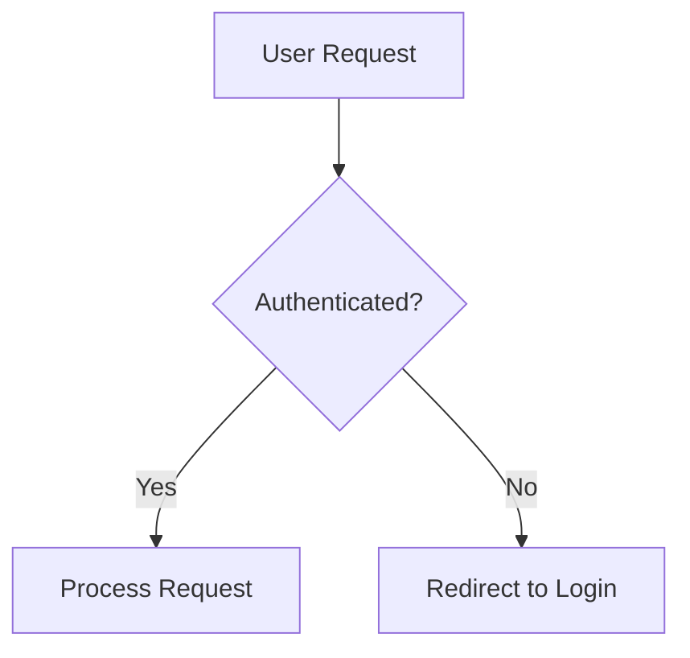

# Documentation.AI Components Reference

> Full reference for all 19 components available in Documentation.AI. Each component can be inserted via the Web Editor's slash (`/`) command menu or written directly in MDX.

---

## Table of Contents

- [Content Fundamentals](#content-fundamentals)
  - [Headings and Text](#1-headings-and-text)
  - [Lists and Tables](#2-lists-and-tables)
  - [Code and Groups](#3-code-and-groups)
- [Layout and Navigation](#layout-and-navigation)
  - [Card](#4-card)
  - [Columns](#5-columns)
  - [Collection List](#6-collection-list)
  - [Collection Content](#7-collection-content)
- [Media and Visuals](#media-and-visuals)
  - [Images](#8-images)
  - [Videos and Iframes](#9-videos-and-iframes)
  - [Mermaid Diagrams](#10-mermaid-diagrams)
- [Interactive and Structural](#interactive-and-structural)
  - [Callout](#11-callout)
  - [Expandables](#12-expandables)
  - [Steps](#13-steps)
  - [Tabs](#14-tabs)
  - [Board](#15-board)
  - [Update](#16-update)
- [API Documentation](#api-documentation)
  - [Param Field](#17-param-field)
  - [Response Field](#18-response-field)
  - [API Components](#19-api-components-request--response)

---

## Content Fundamentals

### 1. Headings and Text

**Purpose:** Structure pages with headings, paragraphs, inline formatting, and links.

The page title renders as H1; body headings start at `##`.

#### Web Editor
- Use the `/` slash menu → choose **Heading 2**, **Heading 3**, or **Heading 4**.
- Select text and use the floating toolbar for **Bold**, *Italic*, ~~Strikethrough~~, `inline code`, or `<kbd>` keyboard style.
- Click the link icon in the toolbar to set internal (type `/` to search pages) or external links.

#### MDX Syntax

```markdown
## Section title
### Subsection
#### Detail

**Bold**, *italic*, ~~strikethrough~~, `inline code`

Press <kbd>Ctrl</kbd> + <kbd>C</kbd> to copy.

[Internal link](/getting-started/quickstart)
[External link](https://documentation.ai)
```

#### Notes
- Use `<br />` sparingly for manual line breaks within a paragraph.
- Prefer separate paragraphs, lists, Steps, or Tabs for layout and flow needs.

---

### 2. Lists and Tables

**Purpose:** Organize information with ordered lists, unordered lists, and data tables.

#### Web Editor
- `/` menu → **Bullet List** or **Numbered List**.
- `Tab` to nest; `Shift + Tab` to outdent.
- `/` menu → **Table** to insert a table. Hover rows/columns for controls (reorder, header toggle, alignment, delete).

#### MDX Syntax

**Ordered list:**
```markdown
1. First item
2. Second item
3. Third item
```

**Unordered list (prefer `-`):**
```markdown
- First item
- Second item
```

**Nested list:**
```markdown
1. Parent item
   - Nested unordered
   1. Nested ordered
```

**Table:**
```markdown
| Feature   | Status      |
| :-------- | ----------: |
| Auth      | Complete    |
| Dashboard | In progress |
```

- `:----` = left align, `:----:` = center, `----:` = right align.

#### Notes
- For detailed step-by-step procedures, prefer the `<Steps>` component.
- For API schemas, prefer `<ParamField>` / `<ResponseField>` over hand-written tables.

---

### 3. Code and Groups

**Purpose:** Display syntax-highlighted code blocks with a copy button; tabbed multi-language examples via CodeGroup.

#### Web Editor
- `/` menu → **Code Block** → use the language dropdown for syntax highlighting.
- `/` menu → **Code Group** → rename tabs by double-clicking, add tabs with `+`.

#### MDX Syntax

**Single code block:**
````markdown
```typescript
const apiCall = async () => {
  const response = await fetch("/api/docs");
  return response.json();
};
```
````

**CodeGroup (tabbed):**
````jsx
<CodeGroup tabs="TypeScript,Python,Bash">
```typescript
const response = await fetch("/api/docs");
```

```python
import requests
response = requests.get("/api/docs")
```

```bash
curl https://api.example.com/docs
```
</CodeGroup>
````

#### Code Block Options

| Attribute | Description | Example |
|-----------|-------------|---------|
| `highlight` | Highlight specific lines or ranges | `highlight="1-2,5"` |
| `focus` | Dim non-focused lines | `focus="2,4-5"` |
| `show-lines` | Show line numbers | `show-lines={true}` |
| `wrap` | Wrap long lines instead of scrolling | `wrap="true"` |
| `tabs` | Custom tab labels for CodeGroup | `tabs="TS,Python"` |

---

## Layout and Navigation

### 4. Card

**Purpose:** Create visually rich, clickable navigation and feature blocks with titles, icons, images, and CTA text.

#### Web Editor
- `/` menu → **Card** or **Card Group** (for multi-column grids).
- Edit title, URL, icon, image, CTA, and layout via the three-dot menu → **Card Settings**.

#### MDX Syntax

**Single card:**
```jsx
<Card title="Quickstart" icon="zap" href="/getting-started/quickstart">
  Get up and running in minutes.
</Card>
```

**Horizontal layout:**
```jsx
<Card
  title="GitHub Repository"
  icon="github"
  href="https://github.com/example/repo"
  cta="View on GitHub"
  horizontal={true}
>
  Explore the source code.
</Card>
```

**Card with image:**
```jsx
<Card
  title="Deployment Guide"
  icon="cloud"
  href="/deploy"
  image="https://example.com/header.png"
>
  Step-by-step deployment instructions.
</Card>
```

#### Attributes

| Attribute | Type | Required | Description |
|-----------|------|----------|-------------|
| `title` | string | ✅ | Card heading text |
| `href` | string | ✅ | Link destination (relative or absolute) |
| `icon` | string | No | Lucide icon name |
| `image` | string | No | Header image URL (full card width) |
| `cta` | string | No | Call-to-action button text |
| `horizontal` | boolean | No | Side-by-side layout (`false` = stacked, default) |
| `target` | string | No | `_self` (default) or `_blank` |

> Icons use the [Lucide](https://lucide.dev/icons) library. Common names: `book-open`, `code`, `database`, `lock`, `zap`, `shield`, `github`.

---

### 5. Columns

**Purpose:** Arrange content in responsive multi-column grid layouts (2, 3, or 4 columns).

#### Web Editor
- Use **Card Group** for card-only grids.
- For mixed content, switch to MDX view and use `<Columns>` directly.

#### MDX Syntax

```jsx
<Columns cols={3}>
  <Card title="Fast" icon="zap" href="#">Optimized for speed.</Card>
  <Card title="Secure" icon="shield" href="#">Built with security.</Card>
  <Card title="Scalable" icon="trending-up" href="#">Grows with you.</Card>
</Columns>
```

**Mixed content:**
```jsx
<Columns cols={2}>
  <Callout kind="info">Info in column one.</Callout>
  <Callout kind="tip">Tip in column two.</Callout>
</Columns>
```

#### Responsive Behavior

| Screen Size | `cols={2}` | `cols={3}` | `cols={4}` |
|-------------|-----------|-----------|-----------|
| Mobile | 1 column | 1 column | 1 column |
| Tablet | 2 columns | 2 columns | 2 columns |
| Desktop | 2 columns | 3 columns | 4 columns |

#### Attribute

| Attribute | Type | Description |
|-----------|------|-------------|
| `cols` | number | Number of columns: `2`, `3`, or `4` |

---

### 6. Collection List

**Purpose:** Auto-generate card, accordion, list, or link layouts from your navigation tree (direct children of a node).

#### Web Editor
- `/` menu → **Collection List** (Dynamic category) → visual navigation tree picker.

#### MDX Syntax

```jsx
<CollectionList node="tabs:Guides" layout="cards" cols={2} />
```

#### `node` Path Format

Uses `type:name` segments separated by `/`:

| Path | Targets |
|------|---------|
| `tabs:Guides` | The "Guides" tab |
| `groups:Getting Started` | The "Getting Started" group |
| `tabs:API/groups:Auth` | The "Auth" group inside the "API" tab |

#### Layouts

| Layout | Use case |
|--------|----------|
| `cards` | Landing pages with visual browsing |
| `accordion` | Compact, expandable overview |
| `list` | Clean minimal navigation |
| `links` | Lightweight inline links |

#### Card Variants (cards layout only)

| Variant | Description |
|---------|-------------|
| `default` | Icon left, name and count right |
| `horizontal` | Wider horizontal card |
| `centered` | Icon and text centered |

#### Attributes

| Attribute | Type | Required | Description |
|-----------|------|----------|-------------|
| `node` | string | ✅ | Navigation node path |
| `layout` | string | No | `cards`, `accordion`, `list`, or `links` (default: `cards`) |
| `cols` | number | No | Grid columns for `cards` layout: 1–4 (default: `2`) |
| `card-variant` | string | No | Card style for `cards` layout |
| `default-open` | boolean | No | Whether accordion starts expanded (default: `true`) |

---

### 7. Collection Content

**Purpose:** Render the full nested tree under a navigation node as a recursive collapsible accordion (all levels, not just direct children).

#### Web Editor
- `/` menu → **Collection Content** (Dynamic category) → visual navigation tree picker.

#### MDX Syntax

```jsx
<CollectionContent node="tabs:Guides" default-expanded={false} />
```

#### Attributes

| Attribute | Type | Required | Description |
|-----------|------|----------|-------------|
| `node` | string | ✅ | Navigation node path (`type:name/type:name`) |
| `default-expanded` | boolean | No | Start all nodes expanded (default: `false`) |

#### CollectionList vs CollectionContent

| Scenario | Use |
|----------|-----|
| Landing page for a section | `CollectionList` (cards) |
| Quick inline links | `CollectionList` (links) |
| FAQ browsing | `CollectionList` (accordion) |
| Full table of contents (deep section) | `CollectionContent` |
| Only direct children | `CollectionList` |
| Entire nested hierarchy | `CollectionContent` |

---

## Media and Visuals

### 8. Images

**Purpose:** Add CDN-optimized, responsive images with alt text.

#### Web Editor
- `/` menu → **Image** → upload or select an existing image.
- Drag handles to resize; three-dot menu for alt text, caption, and URL.

#### MDX Syntax

```jsx
<Image
  src="https://your-cdn.com/image.png"
  alt="Descriptive alt text"
  width="800"
  height="600"
/>
```

**Centered with custom width:**
```jsx
<Image
  src="https://your-cdn.com/image.png"
  alt="Center aligned image"
  width="400"
  height="300"
  style="width: 400px; height: auto; margin: 0 auto;"
/>
```

#### Attributes

| Attribute | Type | Required | Description |
|-----------|------|----------|-------------|
| `src` | string | ✅ | Absolute image URL |
| `alt` | string | ✅ | Accessible description (required for SEO) |
| `width` | string | No | Width in pixels |
| `height` | string | No | Height in pixels |
| `style` | string | No | Inline CSS for alignment/sizing |
| `priority` | boolean | No | Load immediately (above-the-fold) |
| `fetchpriority` | string | No | `high`, `low`, or `auto` |

#### Supported Formats
JPEG, JPG, PNG, GIF, WebP, SVG, ICO. Only absolute URLs are supported.

---

### 9. Videos and Iframes

**Purpose:** Embed YouTube, Vimeo, Loom, MP4 videos, or external tools (forms, dashboards) via iframe.

> **Note:** Direct video upload to the platform is not supported. Use a third-party platform (YouTube, Vimeo, Loom) or an MP4 URL.

#### Web Editor
- `/` menu → **Video** → paste a video URL or iframe embed code → **Insert Video**.

#### MDX Syntax

**`<Video>` — iframe mode (YouTube, Vimeo, Loom):**
```jsx
<Video
  src="https://www.youtube.com/embed/Reu01KxMSF0"
  title="Feature overview"
  width="672"
  height="378"
  allow-full-screen="true"
  style="width: 100%; max-width: 672px; height: auto;"
/>
```

**`<Video>` — HTML5 mode (self-hosted MP4/WebM):**
```jsx
<Video
  src="https://example.com/video.mp4"
  controls="true"
  poster="https://example.com/poster.jpg"
  preload="metadata"
  width="672"
  height="378"
/>
```

**`<Iframe>` — non-video embeds (forms, dashboards):**
```jsx
<Iframe
  src="https://docs.google.com/forms/d/e/example/viewform"
  title="Customer feedback form"
  width="100%"
  height="600"
  sandbox="allow-scripts allow-same-origin allow-presentation"
/>
```

#### Key Props

| Prop | Component | Description |
|------|-----------|-------------|
| `src` | Both | Video/iframe URL (required) |
| `title` | Both | Accessible title for screen readers |
| `width` / `height` | Both | Dimensions in pixels |
| `allow-full-screen` | Both | Allow fullscreen (default: `true`) |
| `controls` | Video (HTML5) | Show native browser controls |
| `autoplay` | Video (HTML5) | Auto-start playback |
| `muted` | Video (HTML5) | Start muted (required for autoplay) |
| `loop` | Video (HTML5) | Loop playback |
| `poster` | Video (HTML5) | Thumbnail shown before playback |
| `sandbox` | Iframe | Security restrictions |

---

### 10. Mermaid Diagrams

**Purpose:** Create interactive flowcharts, sequence diagrams, and other code-defined diagrams with zoom and fullscreen.

#### Web Editor
- `/` menu → **Code Block** → set language to `mermaid` → paste diagram definition.

#### MDX Syntax

````markdown

````

#### Supported Diagram Types

| Type | Keyword | Use for |
|------|---------|---------|
| Flowchart | `graph TD` / `graph LR` | Processes, decision trees |
| Sequence | `sequenceDiagram` | API calls, message flows |
| Class | `classDiagram` | OOP structures |
| State | `stateDiagram-v2` | App states and transitions |
| Entity Relationship | `erDiagram` | Database schemas |
| Gantt | `gantt` | Project timelines |
| Git Graph | `gitGraph` | Branching strategies |

#### Graph Directions

| Direction | Code | Description |
|-----------|------|-------------|
| Top to Bottom | `graph TD` | Default vertical |
| Left to Right | `graph LR` | Horizontal |
| Bottom to Top | `graph BT` | Reverse vertical |
| Right to Left | `graph RL` | Reverse horizontal |

#### Interactive Features
- Zoom in/out (50%–300%) and reset via hover controls.
- Fullscreen mode for complex diagrams.
- Automatic light/dark theme support.

#### Attributes

| Attribute | Type | Required | Description |
|-----------|------|----------|-------------|
| `language` | string | ✅ | Must be `mermaid` |
| `chart` | string | ✅ | Valid Mermaid diagram definition |
| `id` | string | No | Custom identifier (auto-generated if omitted) |

---

## Interactive and Structural

### 11. Callout

**Purpose:** Highlight tips, warnings, success messages, and critical notes in a styled boxed section.

#### Web Editor
- `/` menu → search **Callout** → choose the style (Info, Tip, Alert, Danger, Success).

#### MDX Syntax

```jsx
<Callout kind="info">
  Configure your API key in settings before making requests.
</Callout>

<Callout kind="tip">
  Use environment variables for sensitive credentials.
</Callout>

<Callout kind="alert">
  This action cannot be undone. Back up your data first.
</Callout>

<Callout kind="danger">
  Deleting this workspace permanently removes all data.
</Callout>

<Callout kind="success">
  Your documentation has been successfully deployed.
</Callout>
```

#### Callout Kinds

| `kind` | Use for |
|--------|---------|
| `info` | Neutral notes or clarifications |
| `tip` | Shortcuts, recommendations, best practices |
| `alert` | Warnings requiring extra attention |
| `danger` | Destructive or high-risk actions |
| `success` | Positive confirmations and outcomes |

#### Attributes

| Attribute | Type | Required | Description |
|-----------|------|----------|-------------|
| `kind` | string | No | Visual style (default: `info`) |
| `collapsed` | string | No | `"true"` hides content until expanded; `"false"` (default) shows fully |

---

### 12. Expandables

**Purpose:** Hide detailed content behind a clickable title for progressive disclosure.

#### Web Editor
- `/` menu → **Expandable** (single) or **Expandable Group** (multiple with consistent styling).
- Set default state via the expand/collapse icon in the header.

#### MDX Syntax

**Single expandable:**
```jsx
<Expandable title="Advanced configuration" default-open="false">
  Add your detailed content here — text, lists, code, callouts, etc.
</Expandable>
```

**Expandable starting open:**
```jsx
<Expandable title="Getting started guide" default-open="true">
  This starts open for key onboarding content.
</Expandable>
```

**Group of expandables:**
```jsx
<ExpandableGroup>
  <Expandable title="Installation" default-open="true">
    ```bash
    npm install documentation-ai
    ```
  </Expandable>

  <Expandable title="Configuration" default-open="false">
    Create `documentation.json` in your project root.
  </Expandable>

  <Expandable title="Deployment" default-open="false">
    ```bash
    npm run deploy
    ```
  </Expandable>
</ExpandableGroup>
```

#### Attributes (`<Expandable>`)

| Attribute | Type | Required | Description |
|-----------|------|----------|-------------|
| `title` | string | No | Header text (default: `"Click to expand"`) |
| `default-open` | string | No | `"true"` (open) or `"false"` (closed, default) |

> `<ExpandableGroup>` is a layout wrapper — it takes no attributes.

---

### 13. Steps

**Purpose:** Display sequential, numbered (or icon-based) instructions with connecting visual lines.

#### Web Editor
- `/` menu → **Steps** → click `+` to add steps.
- Three-dot menu per step → **Step Settings** for title, icon, and heading level.

#### MDX Syntax

**Automatic numbering:**
```jsx
<Steps>
  <Step title="Create your account">
    Sign up with your email address.
  </Step>
  <Step title="Verify your email">
    Click the link in your inbox.
  </Step>
  <Step title="Start building">
    Create your first documentation project.
  </Step>
</Steps>
```

**Custom icons:**
```jsx
<Steps>
  <Step title="Clone repository" icon="git-branch">
    ```bash
    git clone https://github.com/your-org/project.git
    ```
  </Step>
  <Step title="Install packages" icon="package">
    ```bash
    npm install
    ```
  </Step>
  <Step title="Start development" icon="play-circle">
    ```bash
    npm run dev
    ```
  </Step>
</Steps>
```

**With heading levels:**
```jsx
<Steps>
  <Step title="Database setup" title-type="h2" icon="database">
    Configure your database connection.
  </Step>
  <Step title="API configuration" title-type="h2" icon="server">
    Set up API endpoints.
  </Step>
</Steps>
```

#### Attributes (`<Step>`)

| Attribute | Type | Required | Description |
|-----------|------|----------|-------------|
| `title` | string | ✅ | Step heading text |
| `icon` | string | No | Lucide icon name (replaces number when set) |
| `title-type` | string | No | HTML heading level: `p` (default), `h2`, or `h3` |
| `children` | node | ✅ | Step content (supports all MDX) |

> `<Steps>` is a container with no configurable attributes. Connecting lines between steps are drawn automatically.

---

### 14. Tabs

**Purpose:** Organize alternative content (platform-specific, language-specific, version-specific) into a smooth tabbed interface.

#### Web Editor
- `/` menu → **Tabs** (creates 2 tabs by default).
- Double-click tab label to rename. `+` to add, `X` to remove.

#### MDX Syntax

```jsx
<Tabs>
  <Tab title="macOS" icon="apple">
    ```bash
    brew install documentation-ai
    ```
  </Tab>
  <Tab title="Windows" icon="monitor">
    ```bash
    winget install documentation-ai
    ```
  </Tab>
  <Tab title="Linux" icon="terminal">
    ```bash
    sudo apt install documentation-ai
    ```
  </Tab>
</Tabs>
```

**Tabs support rich content** including code blocks, Callouts, Steps, lists, images, and other components.

#### Attributes (`<Tab>`)

| Attribute | Type | Required | Description |
|-----------|------|----------|-------------|
| `title` | string | ✅ | Tab label in the navigation bar |
| `icon` | string | No | Lucide icon name alongside the title |
| `children` | node | ✅ | Content shown when the tab is active |

> `<Tabs>` is a container with no configurable attributes. Includes an animated underline indicator.

#### Common Patterns
- Multi-language SDK examples (JavaScript, Python, cURL)
- Platform guides (Windows, macOS, Linux)
- Framework integrations (React, Vue, Angular)
- Environment configs (Dev, Staging, Production)
- Version differences (v1, v2, v3)

---

### 15. Board

**Purpose:** Display roadmaps, feature status, and release plans in a kanban-style column layout.

#### Web Editor
- `/board` → **Board** → name your columns → add cards to each column.
- Drag-and-drop to reorder columns and move cards. Edit column/card settings via three-dot menus.

#### MDX Syntax

**Minimal board:**
```jsx
<Board title="Product roadmap">
  <BoardColumn title="Planned" color="3" icon="check-circle">
    <BoardCard title="Webhook support" />
    <BoardCard title="Bulk export API" />
  </BoardColumn>
  <BoardColumn title="In Development" color="5" icon="play-circle">
    <BoardCard title="Dark mode" />
  </BoardColumn>
  <BoardColumn title="Shipped" color="4" icon="rocket">
    <BoardCard title="SSO with SAML" />
  </BoardColumn>
</Board>
```

**Detailed cards:**
```jsx
<BoardCard
  title="Version pinning"
  description="Let clients lock requests to a specific API version."
  icon="shield"
  author="Priya Shah"
  due-date="2025-02-01"
  created-at="2025-01-10"
/>
```

#### Column Colors

| Index | Color | Index | Color |
|-------|-------|-------|-------|
| 0 | gray | 5 | blue |
| 1 | brown | 6 | purple |
| 2 | orange | 7 | pink |
| 3 | yellow | 8 | red |
| 4 | green | | |

> Colors wrap if you provide an index above 8.

#### Attributes

**`<Board>`**

| Attribute | Type | Required | Description |
|-----------|------|----------|-------------|
| `title` | string | No | Board title (default: `"Board"`) |

**`<BoardColumn>`**

| Attribute | Type | Required | Description |
|-----------|------|----------|-------------|
| `title` | string | ✅ | Column heading |
| `color` | integer | No | Color index 0–8 |
| `icon` | string | No | Lucide icon name |

**`<BoardCard>`** (self-closing)

| Attribute | Type | Required | Description |
|-----------|------|----------|-------------|
| `title` | string | ✅ | Card label |
| `description` | string | No | Supporting context |
| `icon` | string | No | Lucide icon name |
| `due-date` | string | No | Date string e.g. `"2025-02-01"` |
| `author` | string | No | Person associated with the card |
| `created-at` | string | No | Creation date string |

---

### 16. Update

**Purpose:** Create timeline-style changelog entries with a label, description, optional tags, and rich content.

#### Web Editor
- `/` menu → **Update** (inserts with today's date as label).
- Three-dot menu → **Update Settings** for label, description, and tags.

#### MDX Syntax

**Basic entry:**
```jsx
<Update label="2024-10-15" description="v1.2.0">
  Released new analytics dashboard with real-time metrics.
</Update>
```

**With tags:**
```jsx
<Update
  label="2024-10-20"
  description="v2.0.0"
  tags={["breaking", "security", "performance"]}
>
  ### Major release

  - Updated API authentication flow
  - Optimized database queries for 3x faster response times
  - Enhanced security with improved encryption
</Update>
```

**Timeline (stack multiple updates):**
```jsx
<Update label="2024-10-22" description="v2.1.1" tags={["bugfix"]}>
  - Fixed authentication token refresh issue
</Update>

<Update label="2024-10-15" description="v2.1.0" tags={["feature"]}>
  - Added bulk export functionality
</Update>
```

#### Attributes

| Attribute | Type | Required | Description |
|-----------|------|----------|-------------|
| `label` | string | ✅ | Primary label (date or version, shown in sidebar) |
| `description` | string | ✅ | Supporting text below the label |
| `tags` | array | No | Badge strings e.g. `{["feature", "breaking"]}` |
| `children` | node | ✅ | Main content (supports all MDX) |

> The label sidebar uses sticky positioning on desktop while scrolling through long update content.

---

## API Documentation

### 17. Param Field

**Purpose:** Document API parameters with location badges (Path, Query, Header, Body), type labels, and Required/Deprecated indicators.

#### Web Editor
- `/` menu → **Param Field** → three-dot menu → **Parameter** settings for location, name, type, required, and deprecated.

#### MDX Syntax

```jsx
<ParamField path="id" param-type="string" required="true">
  Unique identifier for the resource.
</ParamField>

<ParamField query="limit" param-type="integer" required="false">
  Maximum number of results to return. Defaults to 20.
</ParamField>

<ParamField header="Authorization" param-type="string" required="true">
  Bearer token for authentication.
</ParamField>

<ParamField body="name" param-type="string" required="true" deprecated="false">
  Display name for the resource.
</ParamField>
```

**Hide the location badge:**
```jsx
<ParamField query="token" param-type="string" show-location="false" required="true">
  Authentication token without location badge.
</ParamField>
```

#### Attributes

| Attribute | Type | Required | Description |
|-----------|------|----------|-------------|
| `path` | string | One location required | URL path parameter name |
| `query` | string | One location required | Query string parameter name |
| `header` | string | One location required | HTTP header name |
| `body` | string | One location required | Request body field name |
| `param-type` | string | No | Data type: `string`, `integer`, `boolean`, `object`, `array`, etc. |
| `required` | string | No | `"true"` marks as required (default: `"false"`) |
| `deprecated` | string | No | `"true"` shows deprecated badge (default: `"false"`) |
| `show-location` | string | No | `"false"` hides location badge (default: `"true"`) |

> Use exactly **one** location attribute (`path`, `query`, `header`, or `body`) per `<ParamField>`.

---

### 18. Response Field

**Purpose:** Document API response fields with field name, type, Required/Deprecated status, and rich descriptions.

#### Web Editor
- `/` menu → **Response Field** → three-dot menu → **Response Field** settings for name, type, required, deprecated.

#### MDX Syntax

```jsx
<ResponseField name="id" field-type="string" required="true">
  Unique identifier for the resource.
</ResponseField>

<ResponseField name="description" field-type="string">
  Optional description text for the resource.
</ResponseField>

<ResponseField name="legacy_id" field-type="integer" deprecated="true">
  Deprecated legacy identifier. Use `id` instead.
</ResponseField>

<ResponseField name="user" field-type="object" required="true">
  User object containing profile information and preferences.
</ResponseField>
```

#### Attributes

| Attribute | Type | Required | Description |
|-----------|------|----------|-------------|
| `name` | string | No | Field name in the response payload (default: `"response"`) |
| `field-type` | string | No | Data type: `string`, `integer`, `boolean`, `object`, `array`, etc. |
| `required` | string | No | `"true"` marks as required (default: `"false"`) |
| `deprecated` | string | No | `"true"` shows deprecated badge (default: `"false"`) |

---

### 19. API Components (Request & Response)

**Purpose:** Display API request and response examples in a sticky two-column sidebar layout — main docs on the left, code examples on the right. On mobile, they render as regular inline code blocks.

#### Web Editor
- `/` menu → **Request** or **Response** → add/rename tabs, write code, choose language from dropdown.

#### MDX Syntax

**Request (multi-language SDK examples):**
````jsx
<Request tabs="JavaScript,Python,cURL">
```javascript
const response = await fetch('/api/docs', {
  method: 'POST',
  headers: { 'Authorization': 'Bearer TOKEN' },
  body: JSON.stringify({ title: 'Getting Started' })
});
```

```python
import requests
response = requests.post('/api/docs',
  headers={'Authorization': 'Bearer TOKEN'},
  json={'title': 'Getting Started'}
)
```

```bash
curl -X POST https://api.example.com/docs \
  -H "Authorization: Bearer TOKEN" \
  -d '{"title": "Getting Started"}'
```
</Request>
````

**Response (status-specific examples):**
````jsx
<Response tabs="200,404,500">
```json
{
  "id": "doc-123",
  "title": "Getting Started",
  "status": "published"
}
```

```json
{
  "error": "Document not found",
  "code": "DOC_NOT_FOUND"
}
```

```json
{
  "error": "Internal server error",
  "code": "INTERNAL_ERROR"
}
```
</Response>
````

#### Attributes

**`<Request>`**

| Attribute | Type | Required | Description |
|-----------|------|----------|-------------|
| `tabs` | string | No | Comma-separated tab labels (overrides auto-detected language names) |
| `show-lines` | string | No | `"true"` shows line numbers (shown by default on Request) |
| `default-tab` | string | No | Default active tab index (1-based) |

**`<Response>`**

| Attribute | Type | Required | Description |
|-----------|------|----------|-------------|
| `tabs` | string | No | Comma-separated tab labels (commonly HTTP status codes) |
| `show-lines` | string | No | `"true"` shows line numbers (hidden by default on Response) |
| `default-tab` | string | No | Default active tab index (1-based) |

#### Common Patterns
- Pair one `<Request>` and one `<Response>` block per API endpoint.
- Use `<Request>` tabs for JavaScript, Python, Bash, Go SDK examples.
- Use `<Response>` tabs labeled `200`, `400`, `404`, `500` for different HTTP outcomes.

---

## Component Quick-Pick Guide

| Goal | Component |
|------|-----------|
| Structure and format body text | Headings and Text |
| Bullet points, numbered items, data grids | Lists and Tables |
| Show code with syntax highlighting | Code and Groups |
| Sequential setup or tutorial steps | Steps |
| Platform-specific or alternative content | Tabs |
| Highlight tips, warnings, or alerts | Callout |
| Hide optional details until needed | Expandables |
| Navigation grids and feature showcases | Card + Columns |
| Auto-generated section landing pages | Collection List |
| Full nested navigation tree | Collection Content |
| Screenshots and visual aids | Images |
| Video walkthroughs or embedded tools | Videos and Iframes |
| Architecture and flow diagrams | Mermaid Diagrams |
| Roadmap and feature status | Board |
| Release notes and changelogs | Update |
| API parameter documentation | Param Field |
| API response field documentation | Response Field |
| API request/response code sidebar | API Components |
